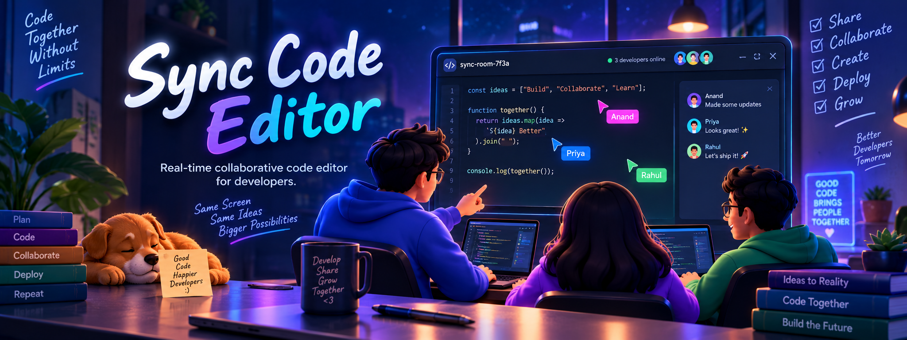

<div align="center">


<br>

<a href="https://sync-code-editor-by-docker.onrender.com/">
  
</a>

<br><br>

</div>


<div align="center">

<a href="https://react.dev/">
  
</a>
<a href="https://vite.dev/">
  
</a>
<a href="https://developer.mozilla.org/en-US/docs/Web/JavaScript">
  
</a>
<a href="https://nodejs.org/">
  
</a>
<a href="https://expressjs.com/">
  
</a>
<a href="https://socket.io/">
  
</a>
<a href="https://microsoft.github.io/monaco-editor/">
  
</a>
<a href="https://www.docker.com/">
  
</a>

</div>

## 📌 About The Project

**Sync Code Editor** is a real-time collaborative code editor built using the **MERN ecosystem, Socket.IO, Monaco Editor, and Docker**.

It allows multiple developers to join the same room, write and edit code together, and see changes instantly across connected users.

Whether you're working with teammates, teaching someone to code, or experimenting together, Sync Code Editor provides a shared coding environment directly in the browser.

---

## ✨ Features

* 📝 **Real-Time Code Editing**

  * Edit code collaboratively in real time.

* 👥 **Multiple Users**

  * Multiple developers can work inside the same room.

* ⚡ **Instant Synchronization**

  * Code changes are synchronized using Socket.IO and WebSockets.

* 🎨 **Monaco Editor**

  * Powerful VS Code-like editing experience.

* 🔗 **Shareable Room IDs**

  * Easily share a room with other developers.

* 🐳 **Dockerized**

  * Run the application consistently using Docker.

* 📱 **Responsive UI**

  * Works across different screen sizes.

* 🔄 **Live Collaboration**

  * See other users' changes without refreshing.

---

## 🖥️ How It Works

```text
              Create / Join Room
                       │
                       ▼
              ┌─────────────────┐
              │   Shared Room   │
              │       ID        │
              └────────┬────────┘
                       │
                       ▼
              ┌─────────────────┐
              │ Monaco Editor   │
              └────────┬────────┘
                       │
                       ▼
              ┌─────────────────┐
              │    Socket.IO    │
              │  Real-Time Sync │
              └────────┬────────┘
                       │
                ┌──────┴──────┐
                ▼             ▼
             User 1         User 2
                │             │
                └──────┬──────┘
                       ▼
              Same Code Instantly
```

### Workflow

1. Create or join a coding room.
2. Share the room ID with other users.
3. Start writing code using Monaco Editor.
4. Socket.IO sends changes between connected users.
5. Other users receive the updates instantly.
6. Collaborate on the same code in real time.

---

## 📂 Project Structure

```text
sync-code-editor-by-docker/
│
├── frontend/
│   ├── src/
│   ├── public/
│   ├── package.json
│   └── ...
│
├── backend/
│   ├── src/
│   ├── package.json
│   └── ...
│
├── assets/
│   └── banner.png
│
├── Dockerfile
├── .dockerignore
├── docker-compose.yml
└── README.md
```

---

## 🚀 Getting Started

Follow these steps to run the project locally.

### 1. Clone the Repository

```bash
git clone https://github.com/your-username/sync-code-editor-by-docker.git
```

```bash
cd sync-code-editor-by-docker
```

---

## 🐳 Run With Docker

### Build the Docker Image

```bash
docker build -t sync-code-editor .
```

### Run the Container

```bash
docker run -p 3000:3000 sync-code-editor
```

Open your browser:

```text
http://localhost:3000
```

---

## 💻 Run Without Docker

### Frontend

```bash
cd frontend
npm install
npm run dev
```

### Backend

Open another terminal:

```bash
cd backend
npm install
npm run dev
```

Make sure both the frontend and backend are running before using the application.

---

## 🌐 Deployment

The application is Docker-ready and can be deployed on:

* 🚀 Render
* 🚂 Railway
* ☁️ AWS
* 🌊 DigitalOcean
* 🔷 Microsoft Azure
* 🌐 Google Cloud

### 🔗 Live Application

<div align="center">

<a href="https://sync-code-editor-by-docker.onrender.com/">
  
</a>

</div>

---

## 📸 Screenshots

### 💻 Collaborative Code Editor


### 👥 Real-Time Collaboration


---

## 🎯 Project Goals

The goal of **Sync Code Editor** is to make collaborative programming simple, fast, and accessible.

Instead of repeatedly sharing files or switching between different communication tools, developers can join a shared room and work on the same code in real time.

### **One Room. One Editor. One Team.**

---

## 🔮 Future Improvements

* 💬 Integrated real-time chat
* 👤 User authentication
* 🎨 Multiple editor themes
* 🗂️ File and folder management
* 🌍 Public and private rooms
* 🔐 Room access controls
* 💾 Persistent code storage
* 🧑‍💻 Live user cursor tracking
* ▶️ In-browser code execution
* 📊 Collaboration activity tracking
* 🔔 User presence indicators

---

## 🤝 Contributing

Contributions are welcome and appreciated!

### 1. Fork the Repository

Create your own fork of the project.

### 2. Create a Feature Branch

```bash
git checkout -b feature/your-feature
```

### 3. Make Your Changes

Implement your feature or fix.

### 4. Commit Your Changes

```bash
git add .
git commit -m "Add new feature"
```

### 5. Push Your Branch

```bash
git push origin feature/your-feature
```

### 6. Open a Pull Request

Create a Pull Request and describe your changes.

---

## 📄 License

This project is licensed under the **MIT License**.

---

## 👨‍💻 Author

<div align="center">

# Anand Jha

### Building tools that make developers more productive 🚀

**Code Together • Collaborate • Build Together**

<br>

⭐ **If you found this project useful, consider giving the repository a star!**

</div>

---

<div align="center">

### ⚡ Sync Code Editor

**Write. Sync. Collaborate.**

</div>
